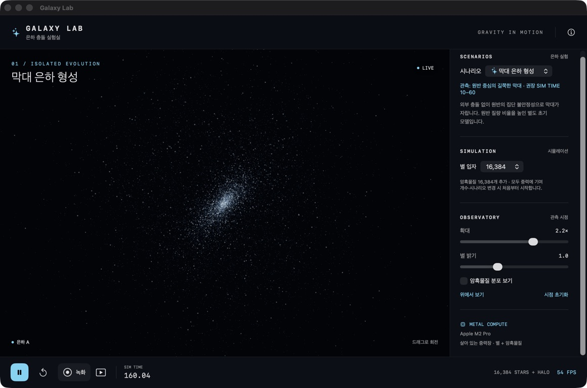
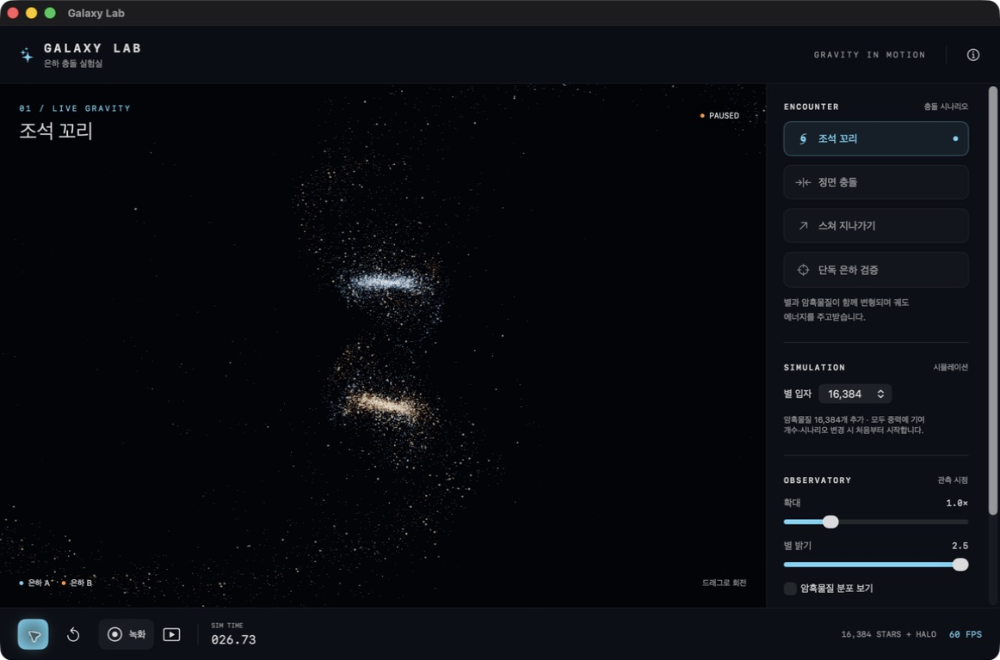

# Galaxy Lab

**Metal로 계산하는 은하 충돌 시뮬레이션 · iOS & macOS**

두 은하가 접근하고, 서로를 변형시키고, 조석 꼬리를 만드는 과정을 실시간으로 관찰합니다. SwiftUI로 조작하고 Metal compute shader로 별과 암흑물질의 중력을 계산합니다. 외부 패키지 의존성은 없습니다.



> 실제 macOS 앱 화면입니다. 파랑과 주황은 각 입자가 처음 속했던 은하를 나타냅니다. 일시 정지 화면의 FPS는 물리 계산 성능을 뜻하지 않습니다.

## 주요 기능

- **살아 있는 중력장** — 별과 암흑물질 모두 중력원으로 참여하며, 분포가 바뀔 때마다 힘을 다시 계산합니다.
- **최대 131,072개 질량 입자** — 별 8,192 / 16,384 / 32,768 / 65,536개와 같은 수의 암흑물질 입자.
- **10개 시나리오** — 기존 충돌·단독 검증에 왜소은하 해체, 고리 은하, 순행·역행 비교, 껍질 은하, 막대 형성을 추가했습니다.
- **관측 조작** — 쿼터니언 트랙볼로 모든 방향 회전, 확대, 별 밝기, 위에서 보기, 암흑물질 분포 표시. 카메라에 Euler 각도 제한을 두지 않습니다.
- **MP4 녹화** — UI를 제외한 은하 장면을 무음 H.264 영상으로 저장하고 미리보기·내보내기·공유.
- **iOS / macOS 공통 코드** — SwiftUI + MTKView, GPU에서 물리 계산과 렌더링 수행.

## 빠른 시작

### 요구 사항

- macOS와 Xcode 15 이상, Metal 셰이더를 컴파일할 수 있는 개발 환경.
- 실행 대상: **macOS 14 이상** 또는 **iOS 17 이상**의 Metal 지원 기기.
- 검증 환경: Xcode 26.6 / Apple M2 Pro. iOS Simulator 및 iOS 기기용 빌드도 확인했습니다.

```sh
git clone https://github.com/ximhear/metal-simulation.git
cd metal-simulation
open GalaxyCollision.xcodeproj
```

Xcode에서 `GalaxyCollision` scheme을 선택하고 **My Mac** 또는 iPhone/iPad를 실행 대상으로 지정한 뒤 Run을 누릅니다. iOS 실기기는 Signing & Capabilities에서 본인의 Development Team을 지정해야 합니다.

프로젝트 파일은 저장소에 포함되어 있습니다. `project.yml`을 수정해 프로젝트를 다시 생성할 때만 [XcodeGen](https://github.com/yonaskolb/XcodeGen)이 필요합니다.

### 명령줄 빌드

```sh
xcodebuild -project GalaxyCollision.xcodeproj -scheme GalaxyCollision \
  -destination 'platform=macOS' -derivedDataPath build/mac CODE_SIGNING_ALLOWED=NO build

xcodebuild -project GalaxyCollision.xcodeproj -scheme GalaxyCollision \
  -destination 'generic/platform=iOS Simulator' -derivedDataPath build/ios CODE_SIGNING_ALLOWED=NO build
```

## 조작

| 조작 | 동작 |
|---|---|
| 재생 / 일시 정지 | 물리 시뮬레이션 진행 제어. macOS: `Space` |
| 처음부터 다시 시작 | 현재 시나리오 초기화. macOS: `R` |
| 시나리오 / 별 개수 선택 | 선택한 초기 조건으로 재시작 |
| 드래그 / 핀치 또는 확대 슬라이더 | 자유 트랙볼 회전과 배율 변경. 가장자리 드래그로 화면 방향 회전도 가능 |
| 암흑물질 분포 보기 | 헤일로 입자 시각화. 꺼도 중력에는 기여 |
| 녹화 → 녹화 종료 | 은하 장면의 MP4 생성, 미리보기 및 저장 |

`SIM TIME`은 실제로 계산된 시뮬레이션 시간입니다. 고정 시간 간격으로 적분하며, GPU 처리량이 부족하면 벽시계보다 느리게 진행됩니다. macOS 기본값은 별 16,384개, iOS 기본값은 별 8,192개입니다.

## 충돌 장면



같은 조석 꼬리 시나리오를 진행한 실제 앱 화면입니다. 충돌 경로와 감속을 애니메이션으로 지정하지 않고 입자들의 중력 상호작용으로 계산합니다.

## 새 은하 실험 (v1.1)

시나리오 메뉴에서 **왜소은하 해체 → 고리 은하 → 순행 / 역행 충돌 → 껍질 은하 → 막대 은하 형성**을 선택할 수 있습니다. 각 사례에 맞는 시야와 관측 시점 안내를 제공하며, 동반 은하 별 강조로 희미한 흐름과 껍질을 관찰할 수 있습니다.


앱의 물리 엔진에서 저장한 입자 좌표를 그린 진단 그림입니다. 각 사례의 초기 조건, 관측 방법, 3,600스텝 검증 결과는 **[새 시나리오 가이드](docs/SCENARIOS.md)**를 참고하세요.

## 중력 계산과 성능

입자를 Morton 키로 정렬하고 **LBVH 트리**를 GPU에서 구성합니다. 가까운 입자는 직접 계산하고, 먼 입자 묶음은 질량·질량중심과 **사중극자(quadrupole) 보정**으로 계산합니다. 질량이 퍼진 방향까지 반영해 트리 방문 횟수를 줄입니다.

Apple M2 Pro, 같은 초기 조건에서 측정한 중력 재계산 시간입니다. 렌더링 FPS와는 별도입니다.

| 별 + 암흑물질 합계 | 중력 재계산 시간 |
|---:|---:|
| 16,384 | 약 11ms |
| 32,768 | 약 15ms |
| 65,536 | 약 33ms |
| 131,072 | 약 75ms |

최대 설정에서는 이전 단극자 LBVH의 약 **250ms → 75ms**, 약 **3.3배** 개선했습니다. 별 개수와 적분 시간 간격은 유지했습니다. macOS 앱의 최대 설정 정면 충돌 초기 구간에서 약 **14 FPS**를 관찰했습니다. 장면·기기·다른 GPU 작업에 따라 성능은 달라집니다.

최대 131,072개 입자 중 512개 대상의 힘을 전체 입자 직접 합산과 비교했을 때 초기 충돌 분포의 상대 RMS 오차는 약 **0.055%**였습니다. 이 값은 표본 검사 결과이며 모든 입자의 오차 상한은 아닙니다.

## 물리 모델

- 기본 모델은 질량 3의 지수 원반과 질량 17의 살아 있는 암흑물질 헤일로입니다. 새 사례는 은하별 질량·크기와 원반/구형 분포를 설정합니다.
- 고정 간격 `1/60`의 kick–drift–kick leapfrog, Plummer softening `0.15`를 사용합니다.
- 위치와 속도를 반전한 입자 쌍으로 초기 질량중심·운동량의 표본 잡음을 줄입니다.
- 가스, 냉각, 별 생성, 피드백, 블랙홀은 포함하지 않습니다.

입자 하나는 여러 별이나 암흑물질의 질량을 대표합니다. 따라서 표시된 별 수는 실제 개별 항성 수가 아닙니다. 근사 평형 초기 조건과 트리 중력으로 집단적인 충돌 과정을 관찰하는 교육용 모델이며, 특정 실제 은하의 미래를 정밀 예측하는 모델은 아닙니다.

초기 조건, GPU 트리 구조, 정확도·에너지 검사, 성능 측정 방법과 참고 자료는 **[상세 기술 문서](docs/SIMULATION.md)**에 정리했습니다.

## 검증

```sh
swift test

swiftc -O GalaxyCollision/Physics/Encounter.swift \
  GalaxyCollision/Physics/EquilibriumTables.swift \
  GalaxyCollision/Rendering/GalaxyDynamics.swift \
  Scripts/MetalSmoke.swift -o /tmp/galaxy-live-smoke
/tmp/galaxy-live-smoke
```

| 스크립트 | 검사 내용 |
|---|---|
| `Scripts/ScenarioSmoke.swift` | 새 여섯 항목의 힘 정확도, 질량·운동량·에너지, 막대 형성, 순행·역행 조건 비교 |
| `Scripts/MetalSmoke.swift` | 직접 합산 힘 비교, 해석적 두 입자 힘, 트리 질량, 특수 분포, 장시간 안정성·충돌 |
| `Scripts/GravityAccuracy.swift` | 최대 입자 수에서 512개 대상 직접 합산 비교, CPU 중심 모멘트 비교 |
| `Scripts/GravityBenchmark.swift` | 입자 수·분포별 GPU 트리 구성 및 힘 계산 시간 |
| `Scripts/RecordingSmoke.swift` | GPU 프레임의 H.264 인코딩, 녹화 종료·오류 처리 |

단독 은하 1,800스텝, 충돌 6,000스텝 검사를 통과했습니다. 이 장시간 검사는 별 8,192 + 헤일로 8,192개에서 수행했으며, 최대 설정에서는 표본 힘 검사와 60스텝 적분을 확인했습니다. 전체 실행 명령과 측정값은 [검증 기록](docs/SIMULATION.md#검증)을 참고하세요.

## 코드 구성

```text
GalaxyCollision/
├── Physics/       # 초기 조건, 평형 분포 테이블, 데이터 구조
├── Rendering/     # Metal 중력 커널, GPU 트리, 렌더러
├── Recording/     # AVAssetWriter 기반 MP4 녹화
└── UI/            # SwiftUI 조작 패널과 녹화 UI
Scripts/           # GPU 정확도·성능·녹화 검사
Tests/             # Swift 물리 모델 테스트
docs/              # 상세 기술 문서와 실제 앱 스크린샷
```
