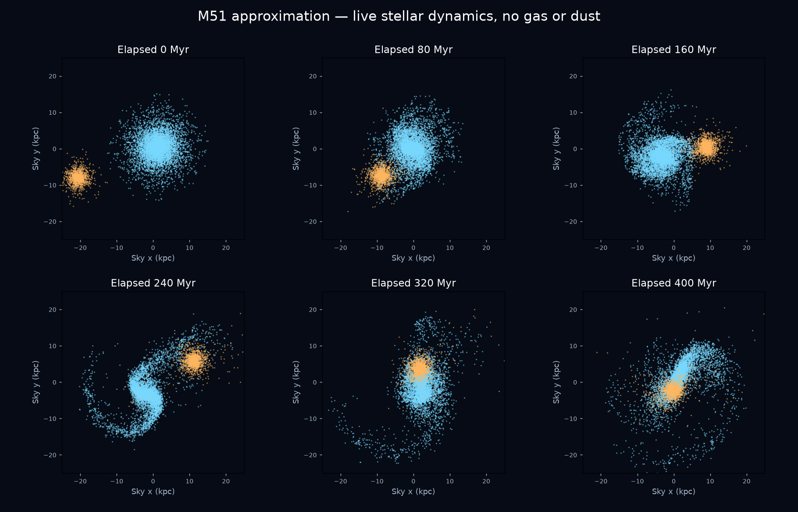
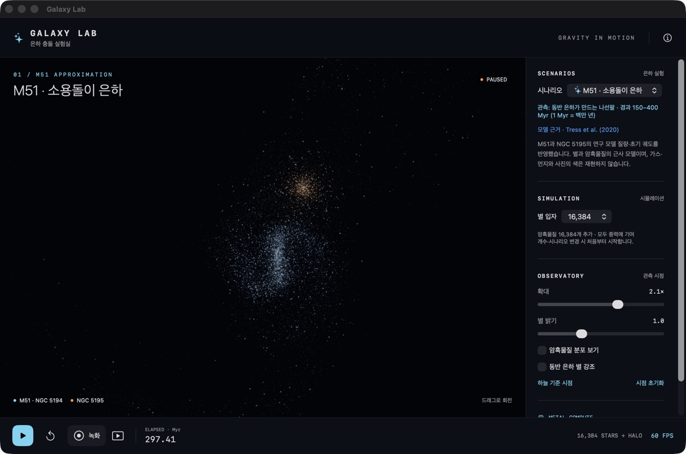

# M51 · 소용돌이 은하 근사 모델

Galaxy Lab 1.2의 M51은 관측을 참고한 연구 모델의 초기 조건을 실시간 N-body 엔진으로 옮긴 실험입니다. M51(NGC 5194)의 별 원반·중심 팽대부·암흑물질과 동반 은하 NGC 5195가 모두 살아 있는 중력원입니다. 나선팔을 미리 심거나 경로를 고정하지 않습니다.

## 적용한 연구 자료

[Tress et al. (2020), §2.5, Tables 2–3](https://academic.oup.com/mnras/article/492/2/2973/5698815)의 질량·원반 크기·상대 궤도를 기준으로 합니다. 위치와 초기 원반 기울기의 출처는 앞선 [Dobbs et al. (2010), §2.2, Table 1](https://academic.oup.com/mnras/article/403/2/625/1180363)입니다.

| 항목 | 앱에 적용한 값 | 처리 |
|---|---|---|
| M51 원반 질량 | 5.30 × 10¹⁰ M☉ | 연구의 별 4.77 × 10¹⁰ + 가스 5.30 × 10⁹을 충돌 없는 원반으로 합산 |
| 중심 팽대부 질량 | 5.30 × 10⁹ M☉ | 원반과 별도로 구형 분포를 샘플링 |
| 헤일로 질량 | 6.04 × 10¹¹ M☉ | 질량을 가진 암흑물질 입자 |
| 원반 지수 척도 | 2.26 kpc | 내부 길이 1 |
| 수직 분포 | sech²(z / 0.6 kpc) | 연구의 h_z = 0.3 kpc 정의와 대응 |
| 헤일로 Hernquist 척도 | 28.7 kpc | 외곽 절단은 아래 근사 참조 |
| NGC 5195 총질량 | 4.00 × 10¹⁰ M☉ | 연구의 단일 연화 질점 대신 살아 있는 구형 은하 |
| 초기 상대 위치 | (−21.91, −8.44, −4.25) kpc | 하늘 x/y, 관측자 방향 +z |
| 초기 상대 속도 | (73.2, −31.2, 188.6) km/s | Tress Table 3의 명시적 상대속도 |
| 초기 원반 기울기 | y축 −20°, 이어서 x축 −10° | 오른손 좌표계에서 회전; 카메라 회전과 별개 |

2010년 표에 인쇄된 두 속도를 단순 차감하면 2020년 상대속도보다 10배 작습니다. 이 구현은 **2020년 Table 3**을 사용합니다. 질량중심 위치와 전체 운동량을 0으로 옮기되 상대 위치·속도는 보존합니다. 관측된 현재 위치를 초기 위치로 잘못 넣지 않습니다.

## 실시간 계산을 위한 근사

- 팽대부의 Hernquist 척도는 0.6 kpc로 넓혔습니다. 연구의 약 0.0903 kpc 중심은 현재의 공통 중력 연화 길이 0.339 kpc보다 작아 해상도에 맞지 않습니다. 팽대부 밀도에는 exp[−(r / 4.8 kpc)²] 감쇠를 곱합니다.
- 헤일로에는 exp[−(r / 200 kpc)²] 감쇠를 곱하고, 표 적분의 최대 반지름 339 kpc 안에서 총질량을 다시 맞춥니다. 따라서 논문의 무한 Hernquist 분포와 내부 질량 분포도 정확히 같지는 않습니다.
- 원반은 15 kpc에서 절단합니다. 속도는 원반의 축대칭 중력과 구형 성분의 합으로 계산하며 Q 처방은 1.5입니다. 속도 표에서 원반 외곽은 무한 지수 원반으로 근사합니다.
- 팽대부와 헤일로는 각자의 밀도에 대해 같은 총 퍼텐셜에서 Eddington 역산을 수행합니다. 이때 원반을 구형화하고, 속도 표에는 연화되지 않은 구형 퍼텐셜을 사용하므로 정확한 평형은 아닙니다.
- 동반 은하는 별 2.5 × 10¹⁰ M☉와 암흑물질 1.5 × 10¹⁰ M☉를 같은 구형 분포로 샘플링합니다. Hernquist 척도 1 kpc, 외곽 감쇠 척도 6 kpc는 시각화와 해상도를 위한 선택이며 관측 피팅 값이 아닙니다. 연구의 3 kpc 연화 질점과도 다릅니다.
- 가스의 압력·냉각·별 생성·먼지 흡수·복사 전달은 계산하지 않습니다. 화면의 파랑·주황은 소속 식별색이며 관측 색이 아닙니다. 따라서 사진처럼 가늘고 밝은 가스 나선팔은 표현하지 못합니다.

이 차이 때문에 근접 통과 시각, 나선팔 위상, 동반 은하 위치가 논문 및 현재 관측과 달라질 수 있습니다. 앱의 300 Myr가 곧 현재의 M51을 뜻하지 않습니다. 전체 형태의 유사성을 관찰하는 근사이며 관측 영상과의 잔차를 최소화한 피팅 결과는 아닙니다.

## 단위와 조작

내부 G = 1, 길이 단위 2.26 kpc, 질량 단위 10¹⁰ M☉입니다. G = 4.30091 × 10⁻⁶ kpc (km/s)² / M☉를 사용하면 속도 단위 약 137.95 km/s, 시간 단위 약 16.02 Myr입니다. 고정 적분 간격 1/60은 약 0.267 Myr입니다. `ELAPSED · Myr`는 실제 수행한 적분 단계의 시간이며 벽시계 시간과 다릅니다.

별 입자의 80%를 M51에, 나머지를 NGC 5195에 배정하고 같은 수의 헤일로 입자를 사용합니다. 팽대부는 M51 별 예산 안에서 질량비에 따라 짝수 개를 나눕니다. 총 입자 수나 프레임당 적분 횟수를 늘리지 않습니다. 드래그는 쿼터니언 카메라만 돌리며 `하늘 기준 시점`은 원래 하늘 좌표 투영으로 돌아갑니다.

## 검증과 재현

```sh
swift test
swiftc -O GalaxyCollision/Physics/Encounter.swift GalaxyCollision/Physics/M51Model.swift \
  GalaxyCollision/Physics/EquilibriumTables.swift GalaxyCollision/Rendering/GalaxyDynamics.swift \
  Scripts/ScenarioSmoke.swift -o /tmp/galaxy-m51-smoke
GALAXY_SCENARIO=m51 GALAXY_TEST_STEPS=1800 GALAXY_SNAPSHOTS=/tmp/galaxy-m51-snapshots /tmp/galaxy-m51-smoke
# 선택 사항: numpy, matplotlib 필요
python Scripts/PlotM51.py /tmp/galaxy-m51-snapshots docs/images/m51-evolution.png
```



그림은 별 8,192개 + 암흑물질 8,192개의 GPU 적분에서 추출한 별 분포이며, 합성 사진이나 생성형 이미지가 아닙니다.

Apple M2 Pro에서 별 8,192개 + 헤일로 8,192개로 1,800스텝(약 480 Myr)을 수행했습니다. 128개 표적에 대한 초기 직접 합산 대비 중력 상대 RMS 오차는 **0.0913%**, 마지막 총에너지 상대 변화는 **0.00857%**였습니다. 이 수치는 적분·중력 근사의 검증이며 관측 일치도의 검증은 아닙니다.

Swift 테스트 15개는 단위 환산, 연구의 상대 위치·속도, 질량 예산, 모든 선택 입자 수에서 팽대부 대칭 쌍 배정, 팽대부·헤일로 분포의 유한성, 기존 시나리오와 쿼터니언 회전을 검사합니다.

GPU 초기화에서 각 은하와 팽대부의 질량 합, 질량중심 간 상대 위치도 별도로 검사했습니다. 기존 stream/ring/prograde/retrograde/shells/bar를 각각 300스텝 회귀 검증했고 모두 통과했습니다. macOS, iOS Simulator, iPhone용 빌드를 확인했습니다.



별 16,384개 + 헤일로 16,384개를 사용한 실제 앱 화면입니다. 이 화면은 일시 정지 상태이므로 표시된 FPS는 물리 계산 성능을 뜻하지 않습니다.
