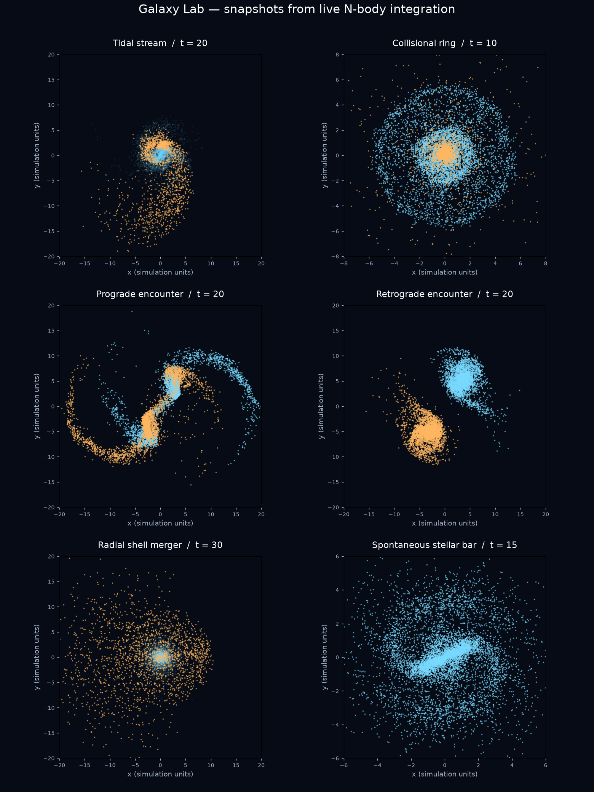

# 은하 실험 가이드

[README](../README.md) · [중력 엔진과 기존 검증](SIMULATION.md)

버전 1.1은 기존 네 가지 실험에 **왜소은하 해체, 고리 은하, 순행·역행 비교, 껍질 은하, 막대 은하 형성**을 추가합니다. 순행과 역행을 별도로 선택하므로 메뉴에는 총 10개 항목이 있습니다. 모든 사례는 같은 GPU 중력 엔진과 고정 시간 간격을 사용하며, 형상을 강제로 만드는 외력이나 정해진 이동 경로는 없습니다.



위 그림은 GPU 시뮬레이션에서 저장한 실제 입자 좌표를 x–y 평면에 그린 진단 그림입니다. 앱 스크린샷이나 관측 사진이 아닙니다. 각 패널은 서로 다른 시각·시야 범위를 사용합니다. 파랑은 주은하, 주황은 동반 은하의 별이며 암흑물질은 생략했습니다. 흐름과 껍질 패널은 주은하 별을 흐리게 표시합니다.

## 관측 방법

iPhone에서는 시나리오 버튼을 누르면 선택 목록이 열립니다. 항목을 고르면 목록이 먼저 닫히고 초기 조건과 권장 카메라가 적용됩니다. v1.1.1부터 초기 분포 테이블·Metal 준비·첫 중력 계산은 별도 직렬 작업 큐에서 수행합니다. 준비 중에는 기존 장면을 유지하고 표시를 바꾸며, 연속 선택 시 취소된 결과는 적용하지 않습니다. 경과 시간은 `SIM TIME`으로 확인합니다. 고리·막대·비교 실험은 원반을 위에서 보며 시작합니다. 왜소은하·껍질 실험은 **동반 은하 별 강조**가 자동으로 켜집니다. 이 옵션은 주은하를 어둡게 그릴 뿐 질량이나 계산을 변경하지 않습니다.

| 실험 | 초기 조건 | 관찰할 시점과 특징 |
|---|---|---|
| 왜소은하 해체 | 질량비 20:1, 거리 9, 상대 속도 `(0, 0.85, 0.18)` | 시간 15–40. 주황 별이 휘어진 흐름으로 늘어나고 궤도를 따라 감김 |
| 고리 은하 | 질량비 5:1, z 방향 거리 10, 원반 법선 방향 상대 속도 3 | 시간 4–15. 주은하 별의 고리 모양 밀도파. 동반 은하는 화면 앞뒤로 통과 |
| 순행 충돌 | 동등 질량, 같은 평면의 원반, 회전과 공전 각운동량이 같은 방향 | 시간 15–30. 길게 뻗는 두 조석 꼬리 |
| 역행 충돌 | 순행과 같은 입자 위치·내부 속력·접근 궤도에서 방위 방향 속도만 반전 | 순행과 같은 시간에 비교. 긴 꼬리가 크게 약해짐 |
| 껍질 은하 | 구형 주은하와 질량비 50:1 위성, 거리 12, 거의 방사형 낙하 | 시간 15–50. 주황 별의 부채꼴 분포와 궤도 바깥 전환점의 활 모양 밀도 경계 |
| 막대 은하 형성 | 단독 원반. 별 질량 8, 헤일로 질량 12, 두께 척도 0.12, Q 처방 1.2 | 시간 10–60. 중심의 길쭉한 막대가 성장하며 회전 |

시점은 별 8,192개·기본 seed에서 확인한 관측 가이드입니다. 입자 수를 바꾸면 잡음, 불안정성의 성장 속도와 세부 모양도 달라집니다. 실제 은하의 연령이나 물리적 시간 단위로 해석하지 않습니다. 고리 실험은 기존 **정면 충돌**과 다르게 작은 구형 동반 은하가 큰 원반의 법선 방향으로 통과합니다.

## 초기 조건 구현

`EncounterConfiguration`은 은하별 질량 배율, 길이 배율, 회전 방향, 구형/원반 분포, 별·헤일로 질량, 원반 두께와 속도 분산 처방을 정합니다.

- 기존 기본 원반: 별 3 + 헤일로 17. 기존 조석 꼬리·정면 충돌·스쳐 지나가기의 궤도는 유지했습니다.
- 구형 모델: 별과 암흑물질 모두 같은 절단 Hernquist 밀도와 등방성 Eddington 분포함수를 샘플링합니다. 기본 척도 길이 1, cutoff 6이며 두 성분 합계 질량 20을 기준으로 배율을 적용합니다. 실제 왜소은하의 별과 헤일로가 동일한 밀도 분포라는 주장은 아닙니다.
- 왜소은하와 고리 실험의 동반 은하 길이 배율은 0.5입니다. 껍질 실험은 질량 배율 0.02, 길이 배율 0.8의 더 가볍고 느슨한 위성을 사용합니다.
- 길이 배율 R, 질량 배율 M에 따라 위치는 R배, 내부 속도는 `sqrt(M/R)`배로 조정합니다. 원반 테이블은 모델에 맞는 질량·두께·Q와 환산 softening으로 다시 계산합니다. 구형 DF의 구형 퍼텐셜은 여전히 근사 초기 조건이며, 고정 softening 때문에 완전한 닮음 평형을 보장하지 않습니다.
- 질량이 다른 쌍의 초기 위치와 중심 속도는 **질량중심 기준**으로 배치합니다. 초기 총운동량은 0에 가깝습니다.
- 총 별 개수와 총 암흑물질 개수는 그대로 유지합니다. 비대칭 실험에서는 각 성분의 입자를 주은하 75%, 위성 25%로 배분해 위성 구조도 해상도를 확보합니다. 입자별 질량으로 실제 은하 질량비를 맞춥니다.
- 모든 성분의 입자 수를 짝수로 배분해 위치·속도를 반전한 quiet pair를 유지합니다.
- 막대 실험은 별도 초기 모델입니다. `Q=1.2`는 테이블의 근사 속도 분산 처방이며 전 반지름에서 실측 Q가 정확히 1.2임을 뜻하지 않습니다. 초기 잡음에서 성장하는 중력 불안정성을 관찰하고, 막대 모양을 입자에 직접 부여하지 않습니다.

## 검증 결과

Apple M2 Pro에서 별 8,192 + 암흑물질 8,192개, seed 42, dt=1/60으로 각 새 항목을 3,600스텝(시간 60) 진행했습니다. 각 300스텝마다 입자의 유한성·총질량·총운동량·에너지를 검사했습니다.

| 사례 | 시간 60에서 초기 대비 총에너지 변화의 절댓값 |
|---|---:|
| 왜소은하 해체 | 약 0.0017% |
| 고리 은하 | 약 0.063% |
| 순행 충돌 | 약 0.013% |
| 역행 충돌 | 약 0.017% |
| 껍질 은하 | 약 0.014% |
| 막대 은하 형성 | 약 0.035% |

총에너지는 같은 softened tree 퍼텐셜로 평가합니다. 사례별 에너지 변화 2% 미만, 총운동량 크기 0.15 미만, 총질량 오차 0.001 미만 조건을 통과했습니다. 이는 수치 오류 점검이며 실제 은하에 대한 관측 적합도 검증은 아닙니다.

초기 힘은 사례마다 128개 대상 입자를 골라 전체 입자의 직접 합산과 비교했습니다. 기본 검증 해상도의 상대 RMS 오차는 약 0.073–0.133%였습니다. 최대 별 65,536 + 암흑물질 65,536개에서도 초기 힘 표본 검사와 한 스텝 적분을 확인했습니다. 최대 해상도에서 모든 새 사례를 장시간 적분한 것은 아닙니다.

막대의 `A2 = |sum exp(2iφ)|/N`은 주은하 중심 기준 반지름 0.3–3의 별에서 측정했습니다. 초기 약 0.017에서 시간 15에 약 0.44로 증가했고, 시간 60에도 약 0.38이었습니다. 순행·역행은 같은 입자 위치와 내부 운동에너지를 사용하는지 자동 검사합니다. 그림과 궤도 진단으로 고리의 밀도파, 위성의 흐름, 껍질의 활 모양 경계도 확인했습니다.

### 재현

```sh
swift test
swiftc -O GalaxyCollision/Physics/Encounter.swift \
  GalaxyCollision/Physics/EquilibriumTables.swift \
  GalaxyCollision/Rendering/GalaxyDynamics.swift \
  Scripts/ScenarioSmoke.swift -o /tmp/galaxy-scenarios

# 여섯 선택 항목을 각각 3,600스텝 실행
/tmp/galaxy-scenarios

# 특정 항목 / 입자 수 / 진행 길이
GALAXY_SCENARIO=bar GALAXY_TEST_STARS=8192 GALAXY_TEST_STEPS=3600 /tmp/galaxy-scenarios

# 선택적으로 실제 입자 스냅샷 저장
GALAXY_SNAPSHOTS=/tmp/galaxy-snapshots /tmp/galaxy-scenarios

# Python 가상 환경에 numpy, matplotlib을 설치한 경우 진단 그림 생성
python Scripts/PlotScenarios.py /tmp/galaxy-snapshots docs/images/scenarios.png
```

`GALAXY_SCENARIO`: `stream`, `ring`, `prograde`, `retrograde`, `shells`, `bar`. 스냅샷은 32바이트 Particle 배열의 원시 이진 파일이며 버퍼 레이아웃이 바뀌면 다시 생성해야 합니다. 앱에는 Python 의존성이 없습니다.

macOS와 iOS Simulator 빌드·실행 화면을 확인했고, 실제 **iPhone 13 Pro Max (iOS 26.6.1)**에 **1.1 (빌드 2) Release**를 설치하고 실행했습니다. 실기기의 모든 사례에 대한 장시간 성능·발열 검증까지 수행한 것은 아닙니다.

## 해석 범위와 참고 자료

고리 은하의 별 밀도파는 계산하지만 가스 충격파·냉각·새 별 생성은 계산하지 않습니다. 껍질은 위성 별이 궤도 위에서 모이고 퍼지는 구조이며 고정된 동심원으로 그리지 않습니다. 막대와 흐름의 세부 결과는 입자 수, softening, 초기 평형에 영향을 받습니다. 특정 관측 천체를 재현한 모델이 아니라 현상을 관찰하는 이상화 실험입니다.

- [궁수자리 왜소은하의 N-body 조석 해체 모델](https://arxiv.org/abs/1003.1132)
- [NASA: 수레바퀴 은하](https://science.nasa.gov/missions/hubble/hubbles-cartwheel/)
- [Mihos: 조석 잔해와 순행·역행](https://ned.ipac.caltech.edu/level5/Sept03/Mihos/Mihos1.html)
- [방사형 충돌과 껍질 구조 연구](https://arxiv.org/abs/2006.08764)
- [살아 있는 헤일로에서 막대의 형성과 진화](https://academic.oup.com/mnras/article/527/3/7781/7452906)

### 선택 응답성 검사 (v1.1.1)

```sh
swiftc GalaxyCollision/Physics/Encounter.swift \
  GalaxyCollision/Physics/EquilibriumTables.swift \
  GalaxyCollision/Rendering/GalaxyDynamics.swift \
  GalaxyCollision/Rendering/GalaxyPreparation.swift \
  Scripts/PreparationSmoke.swift -o /tmp/galaxy-preparation-smoke
/tmp/galaxy-preparation-smoke
```

메인 액터의 10ms 주기 작업이 은하 준비 중에도 진행되는지, 취소된 요청의 완료가 전달되지 않는지, 준비 완료 후 GPU 버퍼로 적분이 가능한지 검사합니다. M2 Pro의 비최적화 검증 실행에서 226회 응답, 최대 간격 약 25ms를 확인했습니다. 이 수치는 iPhone에서 측정한 메뉴 닫힘 시간은 아닙니다.

### 자유 회전 (v1.1.2)

관측 카메라 자세를 단위 쿼터니언으로 저장하고, 가상 트랙볼 위의 이전·현재 드래그 위치에서 회전 증분을 계산합니다. 증분은 화면 좌표계에서 적용하고 매번 정규화합니다. 구면 바깥은 부드러운 쌍곡면으로 연결하며 반대 방향 벡터도 처리합니다. 기존 yaw/pitch 누적과 ±1.5 라디안 제한을 제거했습니다.

`위에서 보기`는 항등 회전으로, `시점 초기화`는 각 사례의 초기 기울기로 돌아갑니다. 화면과 녹화는 같은 회전 행렬을 사용합니다. 이 회전은 관측 방향만 바꾸며 입자 중력·적분에는 영향을 주지 않습니다.

`swift test`는 정확히 ±90도/180도 자세의 독립 조작, 역방향 드래그 복원, 90도 통과, 20,000회 누적 회전의 정규화·직교성, 화면 밖 반대 방향 입력과 잘못된 뷰 크기를 포함해 총 12개 테스트를 통과했습니다.
